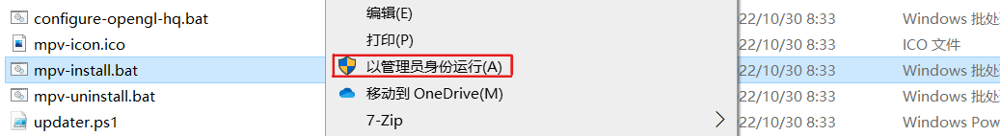

## 介绍


Mpv是基于MPlayer、mplayer2和FFmpeg的免费开源媒体播放器软件。它可以运行在多个操作系统上，包括类Unix和Windows以及Android。
播放器本身没有图形界面，各种设置需要通过手动编写配置文件来完成，对于新手来说会不习惯，但熟悉后你会发现比图形界面还好用，播放界面非常简洁。

- 参考自 [@hooke007](https://hooke007.github.io/index2#mpv-lazy)
- mpv项目地址 [https://github.com/mpv-player/mpv](https://github.com/mpv-player/mpv)
- mpv网页 [https://mpv.io](https://mpv.io)
- 个人使用打包 [mpv](https://cowtransfer.com/s/f98d5fa15bf243)

## 包含文件

```text
.
├───doc
├───installer
├───mpv
├───portable_config
├───d3dcompiler_43.dll
├───mpv.com
├───mpv.exe
└───updater.bat
```

在<code>portable_config</code>文件夹下，有<code>mpv.conf</code>和<code>input.conf</code>两个配置文件，可以根据自身习惯进行更改。

##　安装



打开<code>installer</code>文件，右键以管理员身份运行<code>mpv-install.bat</code>即可。

> [!tip]
> 安装完成后会弹出默认播放器设置，选择mpv。
