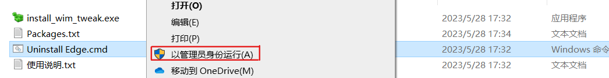

> [!warning]
> win10在版本号更新后，默认浏览器选项会多出一个edge浏览器且无图标。可以使用该工具进行删除，但如果再更新还是会出现。

##　包含文件

```text
.
├───install_wim_tweak.exe
├───Packages.txt
├───Uninstall Edge.cmd
└───使用说明.txt
```

##　使用说明



右键以管理员运行<code>Uninstall Edge.cmd</code>

[打包下载](https://cowtransfer.com/s/be372b04219042)